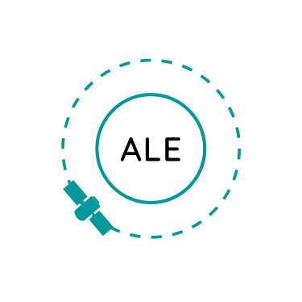

<p align="center">
   
</p>

# Abstraction Layer for Ephemerides (ALE)
[](https://travis-ci.org/USGS-Astrogeology/ale)
[](https://coveralls.io/github/USGS-Astrogeology/ale?branch=master)
[](https://ale.readthedocs.io/en/latest/?badge=latest)
[](https://www1.usgs.gov/csas/doi/#/form/doi:10.5066%2FP906D84L)


This library allows for the position, rotation, velocity and rotational velocity tracking of
multiple bodies in space, especially in relation to one another. It makes extensive use of NAIF's
SPICE data for such calculations.


## Quick Links

  - [Generating an ISD with `isd_generate`](https://astrogeology.usgs.gov/docs/getting-started/using-ale/isd-generate/)

  - [Tutorial: Generating an ISD, Creating a CSM Model, and Converting Coordinates (ALE and Knoten)](https://astrogeology.usgs.gov/docs/getting-started/csm-stack/image-to-ground-tutorial/#tutorial-instantiating-a-csm-camera-model-from-image)

  - [ALE Driver Architecture](https://astrogeology.usgs.gov/docs/concepts/ale/ale-driver-architecture/)


## Using ALE to generate ISDs

To generate an ISD for an image, use the load(s) function. Pass the path to your image/label file and ALE will attempt to find a suitable driver and return an ISD. You can use load to generate the ISD as a dictionary or loads to generate the ISD as a JSON encoded string.

```
isd_dict = load(path_to_label)
isd_string = loads(path_to_label)
```

You can get more verbose output from load(s) by passing verbose=True. If you are having difficulty generating an ISD enable the verbose flag to view the actual errors encountered in drivers.

## Prerequisite: Conda

Conda is a prerequisite for ALE.  If you need it, 
[download and install conda through miniforge](https://conda-forge.org/download/).

## Installing ALE
```sh
# Create an environment ("y" to confirm)
conda create -n ale

# Run this to activate your environment whenever you need to use ALE
conda activate ale

# Install ALE from conda (in your current environment)
conda install -c conda-forge ale
```


## Adding the ALESPICEROOT environment variable
If your ale driver uses NAIF SPICE data, you need to [download NAIF SPICE DATA (see ASC software docs)](https://astrogeology.usgs.gov/docs/getting-started/using-ale/isd-generate/#setting-up-naif-data) and set the ALESPICEROOT variable in one of these two ways:

```sh
# from your shell:
export ALESPICEROOT=/path/to/ale/spice

# from inside a conda env:
conda env config vars set ALESPICEROOT=/path/to/ale/spice
```


## Developing ALE

### Installing ALE with git and conda

Clone ALE from git and create a conda environment with the necessary dependencies.
```sh
git clone --recurse-submodules [paste link from "<> Code" button above]
cd ale
conda env create -n ale -f environment.yml  # "y" to confirm
```

### Conda Environment

Activate the environment whenever you need to use ALE.
```sh
conda activate ale
```
> *You can add `conda activate ale` to the end of your .bashrc or .zshrc if you want the `ale` environment to be active in every new terminal.*


### Building ALE
After you've set up and activated your conda environment, you may then build ALE. Inside
of a cloned fork of the repository, follow these steps:

```bash
python setup.py install
cd build
cmake ..
make
```

Keep in mind that you will need to clone the repository with the `--recursive` flag in order to
retrieve the gtest submodule for testing. If you have already cloned without the `--recursive` flag,
running the following command will retrieve the gtest submodule manually:
```bash
git submodule update --init --recursive
```


## Adding ALE as a dependency

You can add ALE as a dependency of your CMake based C++ project by linking the exported CMake target, `ale::ale`

```c
add_library(my_library some_source.cpp)
find_package(ale REQUIRED)
target_link_libraries(my_library ale::ale)
```


## Running Tests

To test the c++ part of ALE, run `ctest` from the build directory. 

To test the python part of ALE, run `pytest tests/pytests`
